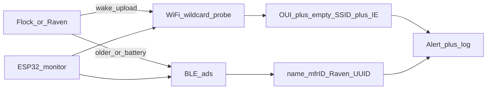
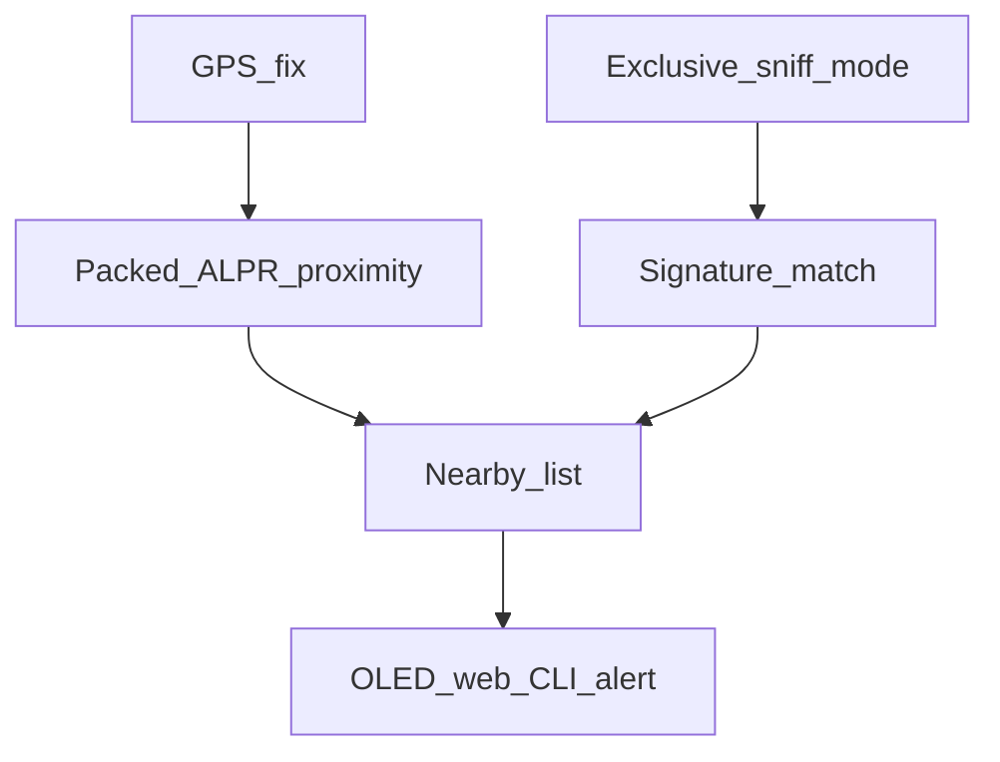

# DeFlock Research + On-Device DB Feasibility

**Question:** Can HardwareOne support a DeFlock-style “nearby ALPR / Flock” awareness feature — live RF detection and/or map proximity — and can a nationwide camera location database fit on-device?

**Constraint:** Research and feasibility only. No firmware, UI, or data-pipeline implementation in this pass.

Date: 2026-07-20 · Scope: research documentation. Implementation deferred until explicitly requested.

---

## 1. Verdict

**Yes on both halves, with clear size and radio constraints.**

1. **Live RF detection (path 1)** is the same class of work as existing ESP32 projects (`flock-you`, WatchFlock, flock-detection, flockdar, FlipDeFlock): passive WiFi promiscuous sniff for Flock probe signatures, optional BLE for older units / Penguin batteries / Raven. Feasible on ESP32-S3 FeatherS3, but it needs an **exclusive radio mode** (conflicts with STA, ESP-NOW, and phone BLE while active). This tree has **no** promiscuous probe sniffer today — only AP scan (`WiFi.scanNetworks`) and targeted G2/ring BLE scans.

2. **Map proximity (path 2)** is realistic in real time using existing GPS (`gGpsCache` / PA1010D) plus a **packed lat/lon index**. Crowdsourced DeFlock/OSM ALPR points for the US are on the order of **~90k–100k+**; stripped to coordinates they are **~0.8–2 MB**, which fits comfortably in the ~10.4 MB LittleFS partition on 16MB boards (`partitions.csv`) or on SD, and can be loaded into PSRAM for queries.

3. **Hybrid** is the right conceptual product: map catches sleeping / cellular-only known cameras; RF catches live / unmapped radios; cross-check raises confidence.

**Coordinates fit. Full GeoJSON / photos / network graphs do not.**

---

## 2. What DeFlock Is vs What Detectors Do

| Piece | Role |
|-------|------|
| **[DeFlock](https://deflock.org) / FoggedLens** | Crowdsourced **map** of ALPRs on OpenStreetMap (`surveillance:type=ALPR`). Awareness + contribution, not RF. |
| **ESP32 “Flock-you” ecosystem** | **Live RF listeners** — promiscuous 802.11 (± BLE), alerts, optional GPS CSV / Flask / Flipper UI. |

DeFlock does not magically sense cameras. Field detectors **listen** for radios the cameras already emit. Neither jams nor deauths; community tooling is passive.

Approximate scale (2026 press / community figures — order of magnitude, not a contract):

| Dataset | Approx count | On-device packed size |
|---------|--------------|----------------------|
| Flock deployed (US, company/press) | ~80k–100k+ | N/A (not all mapped) |
| DeFlock / OSM ALPR (US) | ~90k–100k+ | **~0.8–2 MB** |
| OSM ALPR worldwide | ~336k | **~3–6 MB** |
| Full GeoJSON + metadata | same counts | **tens–100+ MB** — do not ship |

---

## 3. How Live RF Detection Works (Path 1)

Modern Flock Falcon-class units often **hide SSIDs** and wake briefly to upload. Older “scan for `Flock-XXXXXX` beacon / BLE name” methods are incomplete. Current best practice:

### 3.1 Detection methods (confidence ladder)

| Method | Signal | Confidence |
|--------|--------|------------|
| **IE fingerprint + wildcard probe + OUI** | Probe Request, empty SSID IE, known OUI, Information Element layout match ([flock-you](https://github.com/colonelpanichacks/flock-you) gold path) | Highest |
| **Wildcard probe + OUI** | Same without full IE gate | High |
| **SSID patterns** | `Flock-XXXXXX`, `flock`/`flck`, `flocknet` backhaul | Useful when still broadcast; often off |
| **addr1 / addr2 / addr3 OUI** | Receiver / transmitter / BSSID OUI on mgmt frames | Catches sleepers; more false positives — many firmwares disabled broad OUI-only |
| **BLE name / mfr ID / Raven UUID** | e.g. `Penguin-*`, `FS Ext Battery`, mfg `0x09C8` / 2504, Raven services `0x3100–0x3500` | Secondary — many cameras disabled BLE |

Representative projects: `colonelpanichacks/flock-you`, `0xXyc/WatchFlock`, `zmattmanz/flock-detection`, `thehappydinoa/flockdar`, `NSM-Barii/flock-back`, `ReconGrunt/FlipDeFlock`, `rpriven/dantir`.

Typical hardware pattern: ESP32-S3, channel hop 1/6/11 (or 1–13), management-frame filter, OLED/buzzer, optional GPS logging. Range often tens of meters (better with external antenna); cameras sleep, so wait-for-wake matters.

### 3.2 HardwareOne gap (current tree)

| Already present | Missing for path 1 |
|-----------------|---------------------|
| WiFi AP scan (`System_WiFi` / `cmd_wifiscan`) | Promiscuous 802.11 + probe IE parse |
| BLE central for G2 / ring only | General BLE inventory + Flock/Raven signatures |
| ESP-NOW peers, GPS, OLED, web, CLI | Dedicated “sniff mode” that owns the radio |
| LittleFS + SD | Packed ALPR DB + updater (path 2) |

`WiFi.scanNetworks` alone will **not** reliably catch modern STA-mode wildcard probes.

---

## 4. On-Device Location DB Sizing (Path 2)

### 4.1 Packed record sketch

**8–16 bytes per camera** is enough for proximity:

| Field | Size | Notes |
|-------|------|--------|
| `lat` | 4 | `int32` microdegrees or `float32` |
| `lon` | 4 | same |
| `vendor` / `type` | 0–1 | optional `uint8` (Flock, Raven, other, unknown) |
| `flags` | 0–1 | optional (confirmed, facing unknown, etc.) |

**Math:** \(100{,}000 \times 12\,\text{bytes} \approx 1.2\,\text{MB}\).

State/metro packs are tiny (e.g. ~5k cameras ≈ 40–80 KB).

### 4.2 What not to store on-device

- Raw Overpass / GeoJSON with full OSM tags
- Photos, FOV polygons, agency network graphs
- Uncompressed worldwide dumps meant for desktop maps

### 4.3 Fit on this board

- **16MB FeatherS3-class layout:** LittleFS ~10.4 MB (`partitions.csv`) — a 1–2 MB US pack leaves headroom next to LLM models and logs.
- **SD:** same file can live under `/sd/` (same pattern as LLM model swap).
- **Runtime:** load into PSRAM or mmap-style sequential scan with a **geohash / sort-by-lat index**; Haversine only on the shortlist every few seconds when `gGpsCache.hasFix`.

### 4.4 Update model (conceptual)

Ship a **versioned binary pack** (US-first or user-selected state). Refresh over WiFi when convenient — not a live Overpass query every second. Signature OUI/IE tables stay a separate **KB-scale** file from the location pack.

---

## 5. Conceptual Hybrid (Recommended Product Shape)

Two sensors, one alert surface:

1. **Map radar (cheap, always-on-capable):** GPS + packed DB → “known ALPR *N* m away / ahead”
2. **RF radar (dedicated mode):** promiscuous WiFi (+ optional BLE) → “live Flock/Raven signature”
3. **Merge:** same OLED/web “nearby surveillance” list with confidence:

| Observation | Meaning |
|-------------|---------|
| Map only | Known mapped camera, quiet or out of RF range |
| RF only | Live radio, possibly unmapped / new |
| Both (near same point) | High confidence |

### 5.1 Radio exclusivity (hard constraint)

ESP32-S3 shares 2.4 GHz between WiFi and BLE. A promiscuous hop mode **cannot** simultaneously keep mesh ESP-NOW, STA uplink, and phone BLE healthy. Any future implementation needs an explicit **mode switch** (enter/exit sniff), not a background always-on sniffer beside normal networking.

### 5.2 Proximity query sketch (conceptual)

- Alert band: ~150–500 m
- Approaching band: ~1–2 km
- Index: geohash buckets **or** sort-by-lat + binary search
- No full GIS stack required

---

## 6. Feasibility Matrix

| Piece | Feasible? | Constraint |
|-------|-----------|------------|
| Packed US ALPR DB (~1–2 MB) | Yes | Flash/SD file; PSRAM when loaded |
| Real-time GPS proximity | Yes | PA1010D / `gGpsCache` already in tree |
| Live WiFi promiscuous Flock detect | Yes in principle | Exclusive radio mode; maintain OUI/IE lists |
| Simultaneous mesh + sniff + BLE phone | No | Shared radio |
| Worldwide rich GeoJSON | No | Strip to coords or use regional packs |

---

## 7. Explicit Non-Goals (This Document)

Per research scope:

- No new firmware modules, CLI commands, OLED modes, or web pages
- No Overpass download pipeline or checked-in camera coordinates
- No promiscuous WiFi or Flock BLE scanner code
- No jamming, deauth, or offensive RF

When leaving research mode, implement against §5 (hybrid) and §4 (packed DB), not against dumping OSM JSON onto LittleFS.

---

## 8. References (external)

- [DeFlock](https://deflock.org) / [FoggedLens/deflock](https://github.com/FoggedLens/deflock) — crowdsourced OSM ALPR map
- [colonelpanichacks/flock-you](https://github.com/colonelpanichacks/flock-you) — IE + wildcard probe path
- [0xXyc/WatchFlock](https://github.com/0xXyc/WatchFlock), [zmattmanz/flock-detection](https://github.com/zmattmanz/flock-detection), [thehappydinoa/flockdar](https://github.com/thehappydinoa/flockdar), [NSM-Barii/flock-back](https://github.com/NSM-Barii/flock-back), [ReconGrunt/FlipDeFlock](https://github.com/ReconGrunt/FlipDeFlock)

## Internal anchors

- WiFi scan: `components/hardwareone/System_WiFi.cpp`
- GPS cache: `gGpsCache` / `i2csensor_pa1010d*`
- Storage: `partitions.csv` (LittleFS ~10.4 MB on 16MB layout), SD via existing VFS/file manager
- BLE today: G2/ring targeted scans only (`G2_Glasses.cpp`, `G2_Ring.cpp`)
