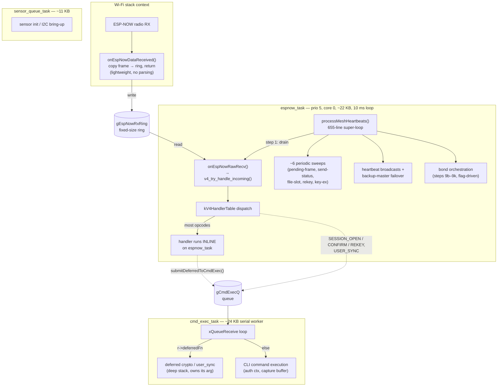
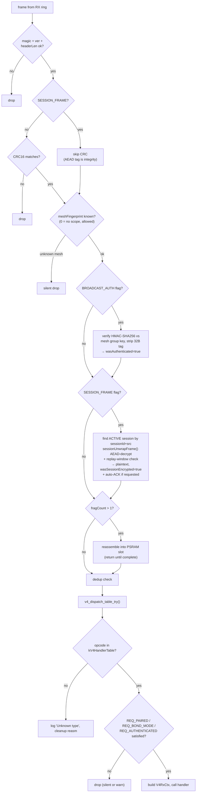
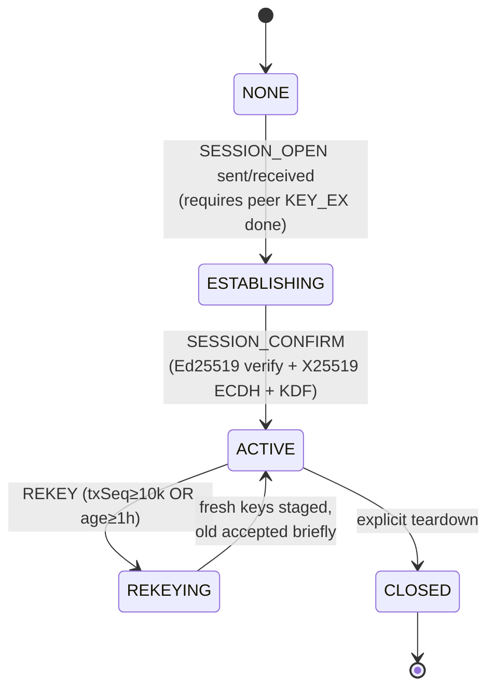
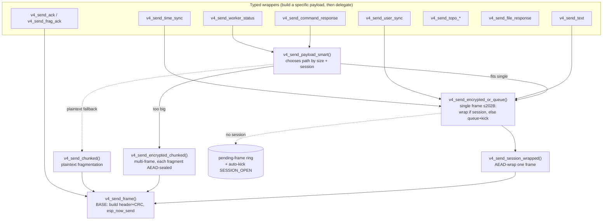
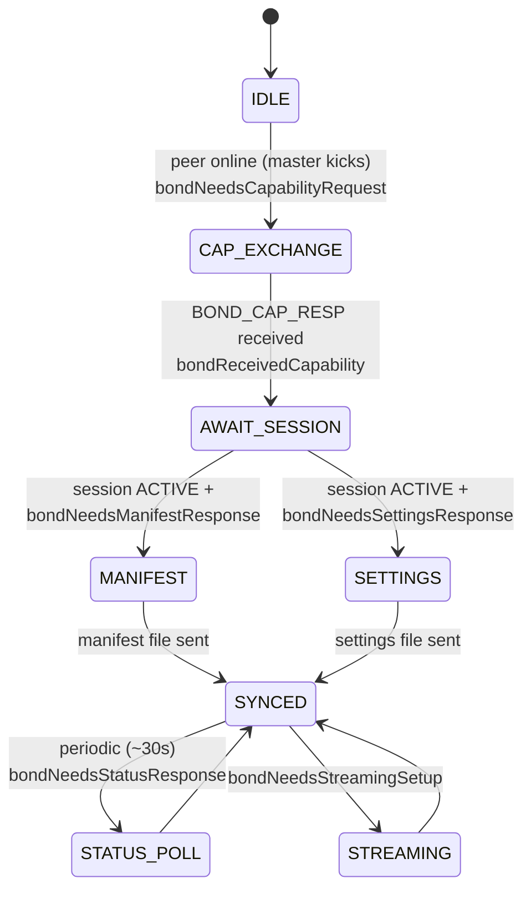

# ESP-NOW System Architecture (as-built)

**Date:** 2026-05-21
**Type:** Reference / architecture map — describes the system **as it actually is today**, not as planned.
**Companion docs:**
- [ESPNOW_V4_PLAN.md](ESPNOW_V4_PLAN.md) — the forward-looking design doc (phases 0–6, crypto design).
- [ESPNOW_SEAM_UNIFICATION.md](ESPNOW_SEAM_UNIFICATION.md) — analysis + proposed consolidation of the fragmentation this doc surfaces (no code; paused pending a real plan).

> **Why this doc exists.** The ESP-NOW subsystem grew by accretion across V3→V4, crypto phases 3.0–3.6, file-transfer phase 4, and subscription phase 5. No single artifact described the *resulting* shape. This map is the ground truth: the task model, the receive pipeline, the opcode/dispatch surface, the session and bond lifecycles, the send-path layering, persistence, and crypto. Source-line references point at [`components/hardwareone/`](../components/hardwareone/).

---

## 0. TL;DR mental model

- A lightweight Wi-Fi-context **receive callback** copies every inbound frame into a ring and returns immediately.
- One **`espnow_task`** (≈22 KB stack, priority 5, core 0) does *almost everything*: it drains the RX ring, runs most opcode handlers **inline**, runs ~6 periodic sweeps, emits heartbeats, and orchestrates bond/mesh state — all in a single **655-line polled super-loop** (`processMeshHeartbeats`) that ticks every 10 ms.
- A second task, **`cmd_exec_task`** (≈24 KB stack), is the deep-stack serial worker. It runs CLI commands *and* a small set of **deferred** ESP-NOW jobs (heavy crypto + `USER_SYNC`) that espnow_task hands off via `submitDeferredToCmdExec`.
- Frames are dispatched through a **declarative handler table** (`kV4HandlerTable`) keyed by opcode, with three gating flags (REQ_PAIRED / REQ_BOND_MODE / REQ_AUTHENTICATED).
- Crypto is **libsodium**: Ed25519 long-term identity, X25519 ephemeral DH → per-peer **session** keys, ChaCha20-Poly1305 AEAD for confidential unicast, HMAC-SHA256 (mesh group key) for authenticated broadcast.
- **Bond mode** is a privileged 1:1 sync channel layered on top, driven by an *implicit* state machine made of ~20 boolean flags polled in the super-loop.

---

## 1. Task / thread topology



| Task | Handle / entry | Stack | Priority / core | Role |
|---|---|---|---|---|
| Wi-Fi RX callback | `onEspNowDataReceived` ([System_ESPNow.cpp:983](../components/hardwareone/System_ESPNow.cpp), registered [7745](../components/hardwareone/System_ESPNow.cpp)) | (Wi-Fi task) | — | Copy frame into `gEspNowRxRing`, return. **No parsing.** |
| `espnow_task` | `espnowHeartbeatTaskFn` → `processMeshHeartbeats` ([6751](../components/hardwareone/System_ESPNow.cpp)); created [7418](../components/hardwareone/System_ESPNow.cpp) | `ESPNOW_HB_STACK_WORDS = 5530` (~22 KB) | `TASK_PRIORITY_HIGH = 5`, core 0 | RX-ring drain + dispatch + sweeps + heartbeats + bond/mesh orchestration. 10 ms tick. |
| `cmd_exec_task` | loop in [HardwareOne.cpp:686](../components/hardwareone/HardwareOne.cpp) | `CMD_EXEC_STACK_WORDS = 6144` (~24 KB) | — | Serial worker. Runs CLI commands **and** deferred ESP-NOW jobs (`deferredFn` fast-path, [HardwareOne.cpp:714](../components/hardwareone/HardwareOne.cpp)). |
| `sensor_queue_task` | — | `SENSOR_QUEUE_STACK_WORDS = 2765` (~11 KB) | — | Sensor inits / I2C bring-up (not part of the ESP-NOW data path). |

Stack constants live in [System_TaskUtils.h](../components/hardwareone/System_TaskUtils.h).

### The load-bearing invariant (deadlock avoidance)

Documented inline at [System_ESPNow.cpp:6739](../components/hardwareone/System_ESPNow.cpp):

> espnow_task is **both** the RX-ring drainer **and** the bond/mesh orchestrator. Because it drains RX, it must never **block** waiting on something that itself depends on RX being processed. The canonical trap: waiting for a session to go `ACTIVE` — the `SESSION_CONFIRM` that completes it arrives via RX and is finished on `cmd_exec_task`. Blocking on espnow_task (or on cmd_exec, which serializes against `runDeferredSessionConfirm`) deadlocks the handshake against itself.

The rule, in one line: **never block a task on a session that the same task is responsible for completing.** Use the event-driven defer-and-retry pattern instead.

---

## 2. Wire format

32-byte fixed header (`EspNowV4Header`, [System_ESPNow_Wire.h](../components/hardwareone/System_ESPNow_Wire.h)), then payload. Max radio frame 250 B → `ESPNOW_V4_MAX_PAYLOAD = 218` B; AEAD tag is 16 B → `ESPNOW_V4_MAX_PLAINTEXT = 202` B per session frame; BROADCAST_AUTH appends a 32 B HMAC tag → 186 B core.

```
magic(2) ver(1) type(1) flags(2) headerLen(1) rsvd(1) msgId(4)
origin[6] ttl(1) fragIndex(1) fragCount(1) rsvd(1)
meshFingerprint(2) sessionId(2) frameSeq(4) crc16(2)            = 32 bytes
```

### Flags (`EspNowV4Flags`, 16-bit)

| Flag | Value | Meaning |
|---|---|---|
| `ACK_REQ` | 0x0001 | Request ACK from receiver |
| `ENCRYPTED` | 0x0002 | **DEPRECATED / vestigial** — legacy LMK-era bit, never set since the LMK ripout |
| `COMPRESS` | 0x0004 | Reserved (future) |
| `STREAM_BEGIN` / `STREAM_END` | 0x0010 / 0x0020 | Stream framing |
| `BROADCAST_AUTH` | 0x0100 | Payload carries trailing HMAC-SHA256 tag keyed by mesh group key |
| `SESSION_FRAME` | 0x0200 | Payload is AEAD-wrapped with a per-peer session key |
| `HANDSHAKE` | 0x0400 | Key-exchange / session-negotiation message |
| `PRIORITY_HIGH` | 0x0800 | Bump above retry queue (events) |

### Opcodes (`EspNowV4Type`)

Renumbered 2026-07 into 20-wide category ranges (1–9 transport … 170–189 bond, 190–199 unallocated buffer, 200–255 user-defined). Reserved/earmarked slots live in the Wire.h comment block, which is the source of truth for the map.

| Range | Opcodes |
|---|---|
| Transport (1–9) | `ACK=1` |
| Crypto — key exchange (3.3) | `KEY_EX_HELLO=10`, `KEY_EX_REPLY=11`, `KEY_EX_CONFIRM=12` |
| Crypto — session (3.4/3.6) | `SESSION_OPEN=13`, `SESSION_CONFIRM=14`, `SESSION_REKEY=15` |
| Discovery / topo / time (30–49) | `HEARTBEAT=30`, `BOOT=31`, `TOPO_REQ=32`, `TOPO_START=33`, `TOPO_PEER=34`, `TIME_SYNC=35`, `PAIR_BEACON=36` |
| App unicast (50–69) | `CMD=50`, `CMD_RESP=51`, `TEXT=52`, `METADATA_REQ=53`, `METADATA_RESP=54`, `METADATA_PUSH=55`, `USER_SYNC=56` |
| Remote FS (70–89) | `FS_LIST_REQ=70`, `FS_LIST_REPLY=71`, `FS_STAT_REQ=72`, `FS_STAT_REPLY=73`, `FS_GET_REQ=74`, `FS_GET_ACK=75` |
| Streaming (90–109) | `STREAM=90` |
| Files (110–129) | `FILE_START=110`, `FILE_DATA=111`, `FILE_END=112`, `FILE_CANCEL=115` |
| Events / subscriptions (5) (130–149) | `SUBSCRIBE_UPDATE=130` |
| Sensors (150–169) | `SENSOR_BROADCAST=150`, `SENSOR_STATUS=151` |
| Bond (170–189) | `BOND_HEARTBEAT=170`, `BOND_CAP_REQ=171`, `BOND_CAP_RESP=172`, `MANIFEST_REQ=173`, `SETTINGS_REQ=174`, `BOND_STATUS_REQ=175`, `BOND_STATUS_RESP=176`, `SCHEMA_REQ=177`, `BOND_STREAM_CTRL=178`, `BOND_SENSOR_DATA=179` |

> **Wire-behavior footnote.** `SETTINGS_RESP`/`SETTINGS_PUSH` and `MANIFEST_RESP` are **not** live opcodes — settings and manifest data arrive as a `FILE_END` for `_settings_out.json` / `_manifest_out.json` and are post-processed inside `v4h_file_end` ([System_ESPNow.cpp:4234](../components/hardwareone/System_ESPNow.cpp)).

---

## 3. Receive pipeline

Every inbound frame flows through `v4_try_handle_incoming` ([System_ESPNow.cpp:3806](../components/hardwareone/System_ESPNow.cpp)) on espnow_task. Stages, in order:



Key properties:
- **Encrypted fragmentation** (task #51/#60): each fragment of a `SESSION_FRAME` is AEAD-sealed *individually* and unwrapped *before* reassembly, so the reassembler accumulates plaintext slices ([System_ESPNow.cpp:3902](../components/hardwareone/System_ESPNow.cpp)).
- **Two authentication signals** flow into the handler via `V4RxCtx` ([System_ESPNow.cpp:2559](../components/hardwareone/System_ESPNow.cpp)):
  - `isAuthenticated` — frame proved possession of *either* the session key (SESSION_FRAME) *or* the mesh group key (BROADCAST_AUTH).
  - `isSessionEncrypted` — narrower; **only** an AEAD-decrypted SESSION_FRAME (genuinely confidential). BROADCAST_AUTH is authenticated-but-plaintext, so it sets `isAuthenticated` but not `isSessionEncrypted`.

### Dispatch gating (`v4_dispatch_table_try`)

| Flag | Enforced as | Used by |
|---|---|---|
| `REQ_PAIRED` | drop if src isn't a paired peer | `CMD`, `FILE_*`, `SUBSCRIBE_UPDATE`, all bond opcodes |
| `REQ_BOND_MODE` | drop if `gSettings.bondModeEnabled` is false | all bond opcodes |
| `REQ_AUTHENTICATED` | drop plaintext (must be SESSION_FRAME or BROADCAST_AUTH) | `TIME_SYNC` (moves the clock) |

---

## 4. Opcode → handler map

`kV4HandlerTable` ([System_ESPNow.cpp:3683](../components/hardwareone/System_ESPNow.cpp)) — declarative; adding an opcode is one row. **Where each handler runs** is the architecturally important column:

| Opcode | Handler | Gating | Runs on |
|---|---|---|---|
| KEY_EX_HELLO/REPLY/CONFIRM | `v4hKeyEx*` | — | espnow_task (HMAC verify is cheap) |
| SESSION_OPEN | `v4hSessionOpen` | — | **deferred → cmd_exec** (Ed25519/X25519) |
| SESSION_CONFIRM | `v4hSessionConfirm` | — | **deferred → cmd_exec** |
| SESSION_REKEY | `v4hSessionRekey` | — | **deferred → cmd_exec** |
| TIME_SYNC | `v4h_time_sync` | REQ_AUTHENTICATED | espnow_task |
| TEXT | `v4h_text` | — | espnow_task |
| CMD | `v4h_cmd` | REQ_PAIRED | quick auth on espnow_task, then `submitCommandAsync` → cmd_exec |
| CMD_RESP | `v4h_cmd_resp` | — | espnow_task |
| HEARTBEAT | `v4h_heartbeat` | — | espnow_task |
| SENSOR_STATUS/BROADCAST | `v4h_sensor_*` | — | espnow_task |
| TOPO_REQ/START/PEER | `v4h_topo_*` | — | espnow_task |
| USER_SYNC | `v4h_user_sync` | — | **deferred → cmd_exec** (as of 2026-05-21; JSON+auth+FS+hashing) |
| METADATA_REQ/RESP/PUSH | `v4h_metadata_*` | — | espnow_task (sets a flag, work done in loop step 9/10) |
| STREAM | `v4h_stream` | — | espnow_task |
| FILE_START/DATA/END | `v4h_file_*` | REQ_PAIRED | espnow_task (FILE_END post-processing is heavy + **inline**) |
| SUBSCRIBE_UPDATE | `v4h_subscribe_update` | REQ_PAIRED | espnow_task |
| BOND_* / BOND_SENSOR_DATA / *_REQ/RESP | `v4h_bond_*` etc. | REQ_PAIRED + REQ_BOND_MODE | espnow_task (mostly set a `bondNeeds*` flag; work done in loop) |

**Deferred today:** SESSION_OPEN, SESSION_CONFIRM, SESSION_REKEY, USER_SYNC. **Everything else runs inline** on espnow_task. (This inconsistency is one of the topics of the seam-unification report.)

The deferral mechanism: `submitDeferredToCmdExec(fn, arg)` ([System_Utils.cpp:3351](../components/hardwareone/System_Utils.cpp)) enqueues an `ExecReq` with `deferredFn` set; cmd_exec's loop runs it on the fast-path ([HardwareOne.cpp:714](../components/hardwareone/HardwareOne.cpp)) and the deferred function owns/free's its arg. The canonical template is `runDeferredSessionConfirm` ([System_ESPNow_Handlers_Crypto.cpp:750](../components/hardwareone/System_ESPNow_Handlers_Crypto.cpp)).

---

## 5. Crypto & identity

libsodium primitives in use: `crypto_sign_*` (Ed25519), `crypto_scalarmult` (X25519), `crypto_aead_chacha20poly1305_ietf_*_detached`, `crypto_kdf_blake2b_derive_from_key`, HMAC-SHA256 (routed through mbedtls for HW SHA accel, task #13), PBKDF2, `randombytes_buf`, `sodium_init`. Wrappers in [System_ESPNow_Crypto.cpp](../components/hardwareone/System_ESPNow_Crypto.cpp).

Three identity/key layers:

| Layer | Struct | Storage | Purpose |
|---|---|---|---|
| **Self long-term** | `EspNowIdentity` (Ed25519 keypair) | `/system/espnow/identity.json` (secret AES-wrapped at rest), [System_ESPNow_Identity.cpp:23](../components/hardwareone/System_ESPNow_Identity.cpp) | This device's permanent cryptographic identity |
| **Peer long-term** | `PeerIdentity` ([System_ESPNow_Identity.h:95](../components/hardwareone/System_ESPNow_Identity.h)) | `/system/espnow/peers/<MAC>/identity.json` | A bonded peer's Ed25519 pubkey + bonded/lastSeen + Phase-5 subscriptions |
| **Per-peer session** | `SessionState` ([System_ESPNow_Sessions.h](../components/hardwareone/System_ESPNow_Sessions.h)) | RAM only (ephemeral) | Forward-secret AEAD keys (tx/rx), replay window, rekey state |

`PeerIdentity` fields: `mac[6]`, `meshId`, `longTermPub[32]`, `bondedAtSec`, `lastSeenSec`, `subscribedEvents`, `valid`.

`SessionState` carries: `aeadKeyTx[32]`/`aeadKeyRx[32]`, `txSeqNext`, `rxSeqHighWater` + `rxSeqBitmap` (64-frame replay window), lifecycle `state`, and Phase-3.6 rekey slots (`aeadKeyRxPrev`, `rekeyEphPrivKey`, deadlines).

### Session lifecycle



KEY_EX (HELLO/REPLY/CONFIRM, opcodes 10–12) is the **prerequisite**: it exchanges and stores `PeerIdentity.longTermPub` so that SESSION_OPEN/CONFIRM signatures can be verified. Sessions are **not** REQ_PAIRED at the table level because they *establish* the relationship; trust comes from the Ed25519 signature against the stored long-term key.

Why the crypto handlers are deferred to cmd_exec: Ed25519 sign/verify + X25519 ECDH need a deeper stack than espnow_task's ~22 KB, and they must not stall the RX drain. The on-RX handler does only a size-check + PSRAM snapshot + `submitDeferredToCmdExec`; the heavy chain runs serially on cmd_exec ([System_ESPNow_Handlers_Crypto.cpp:839](../components/hardwareone/System_ESPNow_Handlers_Crypto.cpp)).

---

## 6. Send-path layering

There are **6 core send layers** plus ~11 typed convenience wrappers. The call graph:



| Function | Line | Role |
|---|---|---|
| `v4_send_frame` | [1436](../components/hardwareone/System_ESPNow.cpp) | **Base** — header + CRC + single `esp_now_send`. Called directly for ACKs and handshake frames. |
| `v4_send_session_wrapped` | [1509](../components/hardwareone/System_ESPNow.cpp) | AEAD-wrap one frame in a SESSION_FRAME. |
| `v4_send_encrypted_or_queue` | [1582](../components/hardwareone/System_ESPNow.cpp) | Single frame: wrap if session ACTIVE, else **park in pending-frame ring + auto-kick SESSION_OPEN**, drain on CONFIRM. The generic "send-when-ready" path. |
| `v4_send_chunked` | [1775](../components/hardwareone/System_ESPNow.cpp) | Plaintext fragmentation. |
| `v4_send_encrypted_chunked` | [1938](../components/hardwareone/System_ESPNow.cpp) | Fragmentation with per-fragment AEAD. |
| `v4_send_payload_smart` | [2098](../components/hardwareone/System_ESPNow.cpp) | Dispatcher: picks encrypted-single / encrypted-chunked / plaintext by size + session. |

Typed wrappers: `v4_send_text`, `v4_send_command_response`, `v4_send_user_sync`, `v4_send_worker_status`, `v4_send_ack`, `v4_send_frag_ack`, `v4_send_time_sync`, `v4_send_topo_start/peer/request`, `v4_send_file_response`.

> **Observation (not a judgment here — see the seam doc):** there are at least three different "entry points" a caller might reasonably reach for (`v4_send_payload_smart`, `v4_send_encrypted_or_queue`, a typed wrapper), and direct `v4_send_frame` calls coexist for ACKs/handshakes. Which to use is currently tribal knowledge.

---

## 7. The super-loop: `processMeshHeartbeats`

One function, **~655 lines** ([6751→7406](../components/hardwareone/System_ESPNow.cpp)), re-entered every 10 ms by `espnowHeartbeatTaskFn`. It interleaves ~30 numbered concerns:

| Step | Concern |
|---|---|
| 1 | Drain RX ring → dispatch (section 3) |
| 1b | Pending encrypted-frame timeout sweep (5 s budget) |
| 1c | Tracked-send status sweep (PENDING→TIMEOUT after 10 s) |
| 1d | Stale file-transfer slot sweep (30 s) |
| 1d | Rekey prev-keys expiry sweep |
| 1d2 | KEY_EX HELLO retry / dead-handshake expiry |
| 1e | REKEY auto-trigger (txSeq≥10k OR age≥1h) |
| 2 | Periodic mesh heartbeat broadcast (5 s) |
| 3a | Master→backup unicast heartbeat |
| 3b | Backup-master self-promotion on master silence |
| 3 / 3c | Paired-mode heartbeat / mark stale peers offline |
| 4 | Topology collection window |
| 6 / 6b | Broadcast tracker timeouts |
| 7 / 7b | Deferred remote CMD + stream-output queue drain |
| 8 | Deferred CMD_RESP processing |
| 9b–9k | **Bond orchestration** (cap/manifest/settings/status/streaming) |
| 9 / 10 | Deferred metadata response / received-metadata store |
| 11 | Text message queue drain |

This is the structural center of gravity — and the structural complexity — of the subsystem.

---

## 8. Bond mode: the implicit state machine

Bond is a privileged 1:1 sync channel (capabilities, manifest, settings, live status, sensor data, streaming control) gated by `REQ_PAIRED + REQ_BOND_MODE`. It has **no explicit FSM**. State lives in ~20 boolean/scalar fields on `EspNowState` ([System_ESPNow.h:709–877](../components/hardwareone/System_ESPNow.h)):

`bondSyncInFlight`, `bondSyncRetryCount`, `bondSyncLastAttemptMs`, `bondNeedsCapabilityRequest`, `bondNeedsStreamingSetup`, `bondNeedsCapabilityResponse`, `bondNeedsManifestResponse`, `bondNeedsSettingsResponse`, `bondReceivedCapability`, `bondCapSent`, `bondNeedsStatusResponse`, `bondNeedsProactiveStatus`, `bondSendWaitDeadlineMs`, `bondNeedsMetadataResponse`, `bondPendingResponseMac[6]`, …

The pattern is **producer/consumer over shared flags**:
- **Producers** — RX handlers set `bondNeeds* = true` ([2873, 3314, 3332, 3338, 3370, 3380, 3401, 3458, 5444](../components/hardwareone/System_ESPNow.cpp)).
- **Consumer** — the super-loop steps 9b–9k poll the flags, do the work (or *defer* it if a session isn't ready), and clear them ([7021, 7115, 7146, 7190](../components/hardwareone/System_ESPNow.cpp)).

Reconstructed as an explicit state machine, the *intended* bond flow is:



> This diagram does **not** exist as code — it is the implicit behavior reverse-engineered from the flags. Making it explicit is the subject of Option 4 in the path-forward discussion (deferred).

### Session-readiness: two coexisting mechanisms

When a bond response needs an active session, two *different* "wait then send" mechanisms are in play:

1. **Generic pending-frame queue** — `v4_send_encrypted_or_queue` parks a single frame, auto-kicks SESSION_OPEN, drains on SESSION_CONFIRM via `pendingFrameDrainForPeer` ([System_ESPNow_Sessions.cpp:448](../components/hardwareone/System_ESPNow_Sessions.cpp)). Used by nearly all unicast app sends.
2. **Bond defer-and-retry** — `bondSendReadyOrDeferred` ([System_ESPNow.cpp:6709](../components/hardwareone/System_ESPNow.cpp)) + `bondSendWaitDeadlineMs` + the heartbeat-tick flag re-check. Used for bond **manifest/settings**, which are large multi-frame file transfers (~44 KB) that the single-frame pending-ring can't hold.

The *send mechanism* legitimately differs (single frame vs file transfer); the *readiness/kick policy* is duplicated. See [ESPNOW_SEAM_UNIFICATION.md](ESPNOW_SEAM_UNIFICATION.md).

---

## 9. Persistence (VFS)

All under `/system/espnow/`. Reads/writes go through `VFS::*Guarded` (PERM audit trail + role rules).

| Path | Contents |
|---|---|
| `/system/espnow/identity.json` | Self Ed25519 identity; secret key AES-wrapped at rest (+ `identity.tmp` for atomic write) |
| `/system/espnow/peers/<MAC>/identity.json` | Per-peer `PeerIdentity` (long-term pubkey, bonded/lastSeen, subscriptions) |
| `/system/espnow/peers/<MAC>/settings.json` | Per-peer remote settings cache |
| `/system/espnow/devices.json` | Paired-device registry |
| `/system/espnow/mesh_peers.json` | Mesh peer roster |

---

## 10. CLI surface (selected)

Registered in the `System_ESPNow.cpp` command table; admin-gated commands use the per-task TLS auth identity (`currentExecIsAdmin()`). Notable: `espnowidentity` / `espnowregenidentity`, `espnowkeyex`, `espnowsessionopen` / `espnowsessions`, `espnowrekey`, `espnowsessionsend`, `espnowsend` (default-encrypted, `--plaintext` escape), `espnowusersync`, `espnowmeshes`. (Full enumeration is out of scope for this map; see the command table directly.)

---

## 11. Glossary

| Term | Meaning |
|---|---|
| **Direct mode** | Point-to-point unicast between two devices. |
| **Mesh mode** | Broadcast fan-out within a mesh (identified by `meshFingerprint`); broadcasts authenticated via BROADCAST_AUTH HMAC, not encrypted. |
| **Bond mode** | Privileged 1:1 sync/RCE channel with its own token; capabilities, manifest, settings, live status. |
| **Session** | Forward-secret per-peer AEAD channel (ephemeral X25519 → ChaCha20-Poly1305). |
| **Deferred work** | A job handed from espnow_task to cmd_exec_task via `submitDeferredToCmdExec`. |
| **The super-loop** | `processMeshHeartbeats`, the 10 ms polled function that *is* espnow_task. |

---

---

## 12. All-encrypted bond (2026-05-21) — shipped + hardware-validated

This supersedes §8's "two coexisting mechanisms" / plaintext-bond description for the bond path. Bond is now fully session-encrypted.

### What shipped
- **Every bond unicast frame rides an AEAD `SESSION_FRAME`.** Senders go through the new `bondSendEncrypted()` helper ([System_ESPNow.cpp](../components/hardwareone/System_ESPNow.cpp), defined just above `v4_send_worker_status`); 15 send sites converted (heartbeat 170, cap req/resp 171/172, manifest_req 173, settings_req 174, status req/resp 175/176, bond_sensor_data 179, bond_stream_ctrl 178). `WORKER_STATUS` (then opcode 83; since removed entirely) was left plaintext **because it had no dispatch-table handler — dead on receive**.
- **Receiver enforcement:** new dispatch flag `V4_OPC_FLAG_REQ_SESSION_ENC` (0x08), checked in `v4_dispatch_table_try`, tagged on all 9 bond opcodes. Plaintext/BROADCAST_AUTH-only bond frames are dropped loudly.
- **Remote-command (`@BOND` token AND `user:pass`) require session encryption** — gate hoisted above both auth branches in `v4_handle_cmd`; the deferred-CMD path carries `deferredCmdWasEncrypted` (set from `ctx.isSessionEncrypted` in `v4h_cmd`). Closes the cleartext-token → RCE hole (the `@BOND` token is a static secret).

### Single session initiator (the load-bearing invariant)
**Anchored on MAC comparison, NOT the mutable bond role.** The higher-MAC device initiates `SESSION_OPEN` (`bondSendEncrypted` uses `!sessionIsASide(self, peer)`); the lower-MAC device only responds. This is config-independent, so a misconfigured two-master/two-worker pair can never *both* initiate.

**Why it must be single-initiator** (proven from code): `sessionAllocate` keeps ONE slot per peer and `espnowSessionOpenInitiate` is **not idempotent**. A simultaneous (crossing) `SESSION_OPEN` makes each side wipe its own in-flight state and complete as *responder* with independent ephemeral keys → two ACTIVE sessions with **different sessionIds and different keys that can't decrypt each other** → bond silently dead. Never hit historically because only the worker ever initiated (lazily, for the manifest file transfer).

### Discovery via the session, not a plaintext beacon
`bondNotifySessionEstablished(peerMac)` (defined in System_ESPNow.cpp, called from both `runDeferredSessionConfirm` initiator and `runDeferredSessionOpen` responder in [System_ESPNow_Handlers_Crypto.cpp](../components/hardwareone/System_ESPNow_Handlers_Crypto.cpp)) sets `bondPeerOnline` and the **master** kicks the capability sync the moment a session goes ACTIVE. Replaces the old "received a plaintext heartbeat = peer online" trigger. Filtered to the bonded peer so non-bond sessions don't spuriously start a bond sync.

### Peer-reboot recovery
On the bond heartbeat-timeout in `processMeshHeartbeats`, if the peer is declared offline we `sessionClear()` the (now-stale) session. Without this, a rebooted peer (which has no session) would silently drop the initiator's encrypted frames forever while the initiator's slot stayed ACTIVE and never re-kicked.

### HW-validated result (build `5be0c30df` / earlier `68ed38f6d`)
Cold pairing of asd (MASTER, higher MAC) + qwe (WORKER): single initiator, session-established hook fires (`[BOND] session ACTIVE with peer — master kicking capability sync`), all bond frames `enc=YES`, both reach `*** SYNC COMPLETE ***` with matching token, stable, no crash.

### Known issue — slow FIRST sync (~25 s)
Encrypted CAP_REQ/MANIFEST_REQ need the session active on *both* ends; a ~1-2 s post-CONFIRM window drops the first few and burns the 3-retry budget → 15 s cooldown. Self-heals. See the `BOND_SYNC_COOLDOWN_MS` comment for tuning options.

### Hazards / follow-ups
- **Mixed firmware is incompatible.** A new device rejects all plaintext bond frames from an old-firmware peer (and vice-versa the old peer can't speak the new handshake). **Reflash both devices together.**
- **Bond token still a static secret** — now confidential in transit, but token-removal / re-derivation is still the deferred task #33. Once all bond traffic rides an authenticated session, the token is arguably redundant.

## 13. Crash post-mortem (2026-05-21) — `/api/bond/paired-devices` null `c_str()`

**Symptom:** device crashes (`LoadProhibited`, `EXCVADDR=0`) when the bond webpage loads — but only on the *first* boot after a fresh pair, never after a reboot.

**Root cause:** `gEspNow` is `ps_alloc`'d (raw memory, no C++ constructor), so `EspNowDevice` `String` members start zeroed; a zeroed Arduino `String` returns **NULL** from `.c_str()`. The secure-pairing add path (System_ESPNow.cpp ~line 8808) set `mac/name/key/meshId` but **not** `friendlyName/room/zone/tags`, leaving them null. `handleBondPairedDevices` (WebPage_Bond.cpp) did `printf("%s", dev.friendlyName.c_str())` → `strlen(NULL)`. After a reboot the device is reloaded from `devices.json` (which assigns `""`), so `.c_str()` is valid → no crash. That's the first-boot-only behavior.

**Fix (two layers):** (1) the pairing add-path now initializes those four String fields to `""` (matches `addEspNowDevice` + the load path); (2) `handleBondPairedDevices` coerces any NULL `c_str()` → `""` defensively.

### Debugging lesson (important for next time)
`addr2line -i` **mis-symbolized** every backtrace frame to inlined ArduinoJson `TextFormatter::writeString`, sending the investigation down a wrong "JSON serializer" path for several iterations. **`xtensa-esp32-elf-nm -nC` mapped the return addresses to their real functions in one shot** (`strlen ← vsnprintf ← webBondSendChunkf ← handleBondPairedDevices`). **For ESP32 backtraces: cross-check `addr2line` against `nm` before trusting inlined frames.** (Helper: build a sorted symbol table with `nm -nC`, then bisect each PC to the nearest preceding `T/t` symbol — see the python snippet used this session.)

---

*This document reflects the codebase as of 2026-05-21 (post Phase 1 bond-send fix, Phase 2a USER_SYNC deferral, all-encrypted bond, and the paired-devices crash fix). Update it when the task model, dispatch table, or session/bond lifecycles change.*
