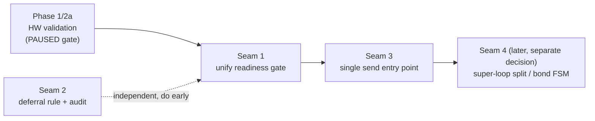

# ESP-NOW Seam Unification — analysis & proposal

**Date:** 2026-05-21
**Status:** Proposal/analysis. **Partially overtaken by events (2026-05-21):** the all-encrypted-bond work shipped a unified bond send path (`bondSendEncrypted`) and a single session-readiness/initiator model for bond — see [ESPNOW_ARCHITECTURE.md §12](ESPNOW_ARCHITECTURE.md) for what actually landed and was hardware-validated. Seam 1 (session-readiness) is now effectively resolved *for the bond path* (one helper, MAC-anchored single initiator). Seams 2 (deferral rule) and 3 (one send entry point across the whole subsystem) remain open. This document analyzes where the ESP-NOW subsystem fragmented into multiple mechanisms for the same job and proposes how to consolidate.
**Prerequisite reading:** [ESPNOW_ARCHITECTURE.md](ESPNOW_ARCHITECTURE.md) (the as-built map).

---

## Framing: what "unify and simplify" means here

Simplicity is measured by **how many distinct concepts a reader must hold to safely change the code**. By that measure the subsystem has been trending the *wrong* way: each phase (3.0–3.6, 4, 5) and each bug fix added a mechanism without retiring the one it sat beside. The result is several places where two or three mechanisms answer the *same* question.

This report targets the **seams** — the duplicated coordination mechanisms — which are lower-risk to unify than the structural core (the 655-line super-loop and the implicit bond FSM, addressed separately as Option 4). The goal of Option 3 is: **one mechanism per concern, made the documented law, with the alternatives deleted.**

A scope boundary worth stating up front: per project memory, **bond mode is the auth/RCE channel with its own token** and is *not* to be folded into the Phase 3.5 default-encrypt rollout. Unifying *coordination seams* (readiness gates, deferral discipline, send entry points) is in scope; changing bond's trust model is not.

---

## Seam 1 — Two "send when the session is ready" mechanisms

### Current state
| Mechanism | Where | Used for |
|---|---|---|
| Generic pending-frame queue | `v4_send_encrypted_or_queue` ([System_ESPNow.cpp:1582](../components/hardwareone/System_ESPNow.cpp)) + `pendingFrameDrainForPeer` ([System_ESPNow_Sessions.cpp:448](../components/hardwareone/System_ESPNow_Sessions.cpp)) | Single unicast frames ≤202 B. Parks frame, auto-kicks SESSION_OPEN, drains on SESSION_CONFIRM, sweeps on timeout. |
| Bond defer-and-retry | `bondSendReadyOrDeferred` ([6709](../components/hardwareone/System_ESPNow.cpp)) + `bondSendWaitDeadlineMs` + heartbeat-tick flag re-check | Bond manifest/settings — large (~44 KB) multi-frame file transfers. |

### Why it's a problem
There are now **two answers** to "is the session up, and who kicks it?" They use different timeouts (5 s sweep vs 4 s deadline), different kick triggers, and different retry loci. A reader fixing a session-timing bug must know which path a given send takes. The Phase 1 bond fix (necessary and correct) *added* the second one rather than extending the first.

### Why they legitimately differ
The *send* mechanism can't be shared: the pending-frame ring holds single frames, but bond manifest/settings are file transfers. That part is real.

### Proposal
Separate the **readiness/kick policy** from the **send mechanism**. Extract one helper — call it `sessionEnsureReadyOrKick(mac)` — with a single timeout constant and a single kick path. Both the pending-frame auto-kick and the bond defer-and-retry call it; only the post-ready action differs (enqueue single frame vs begin file transfer). Net: one readiness concept, two send actions, instead of two of each.

- **Risk:** Medium. Touches the just-stabilized bond path. The kick is shared by the most timing-sensitive flows.
- **Validation:** Pair two devices; confirm (a) normal unicast `espnowsend` still queues+delivers across a cold session, (b) bond manifest+settings still transfer on first pairing, (c) the SESSION_CONFIRM-arrives-at-+0s timing (the original deadlock repro) still resolves without the 6 s stall.
- **Prerequisite:** Phase 1 must be hardware-validated first (see "Sequencing").

---

## Seam 2 — Handler deferral is case-by-case, not a rule

### Current state
Of ~30 dispatch-table handlers, **4 are deferred** to cmd_exec (SESSION_OPEN/CONFIRM/REKEY, USER_SYNC); the rest run **inline** on espnow_task. There is no stated rule for which class a handler belongs to — the architecture-invariant comment ([6739](../components/hardwareone/System_ESPNow.cpp)) explains *why* deferral exists but not *when* it's mandatory.

### Why it's a problem
A reader cannot assume "RX handlers are lightweight." They must memorize the four exceptions. New handlers get added wherever the author happened to look. This is exactly the half-migrated state that's harder to reason about than either extreme — the cost the path-forward discussion flagged.

### Proposal
Adopt and **document** a single rule, then bring the table into compliance:

> **Rule:** an RX handler runs inline only if it is (a) bounded-time, (b) allocation-light, and (c) does no FS I/O, no `deserializeJson` of attacker-sized input, and no crypto beyond a single HMAC verify. Anything else snapshots into PSRAM and `submitDeferredToCmdExec`.

Then audit each inline handler against the rule. The likely additional defer candidate is `v4h_file_end`'s manifest/settings post-processing — **but** that was assessed low-value/high-risk (task #82) and should *stay inline* unless profiling shows a real RX-drain stall. The point of this seam is not to defer more, it's to make the classification a **stated invariant** so the table is self-consistent and `V4RxCtx` snapshotting is the one pattern.

- **Risk:** Low for the documentation+audit; per-handler risk only if a specific handler is actually moved.
- **Validation:** Build + the existing per-opcode flows. Moving any individual handler is validated like USER_SYNC was (exercise its command end-to-end).
- **Prerequisite:** None for the rule/audit; this is mostly a doc + a `static_assert`-style discipline.

---

## Seam 3 — Send-path entry-point sprawl

### Current state
6 core layers + ~11 typed wrappers (see [ESPNOW_ARCHITECTURE.md §6](ESPNOW_ARCHITECTURE.md)). At least three are reasonable "entry points" a caller might pick: `v4_send_payload_smart`, `v4_send_encrypted_or_queue`, or a typed wrapper — and direct `v4_send_frame` calls coexist for ACKs/handshakes.

### Why it's a problem
"Which send function do I call?" has no single answer. The encrypted-vs-plaintext and single-vs-chunked decisions are made in different layers depending on entry point, so the default security posture (encrypted) depends on *how* you sent, not *what* you sent.

### Proposal
Make `v4_send_payload_smart` the **one** application entry point: it already chooses encrypted-single / encrypted-chunked / plaintext correctly. Reclassify the others as explicitly internal (`static`, or a naming convention like `v4_send_raw_*`) so the public surface is: `v4_send_payload_smart` for app payloads, and a small set of intentional low-level exceptions (ACK, frag-ACK, handshake frames) that document *why* they bypass the smart path. Typed wrappers keep their payload-building role but all funnel through `v4_send_payload_smart`.

- **Risk:** Low–medium. Mechanical, but every send site is a potential behavior change if a wrapper currently bypasses encryption intentionally. Each redirect must be checked against the default-encrypt decisions (tasks #46/#59).
- **Validation:** Build; then a matrix pass — for each opcode, confirm it still goes out encrypted-or-plaintext exactly as before (the V4 plan's per-opcode posture table is the oracle).
- **Prerequisite:** None hard, but best done after Seam 1 so the queue/kick path is already unified.

---

## Seam 4 (structural, **out of Option 3 scope** — flagged, not proposed here)

Two larger items are the real center of gravity but are **deliberately not** part of this seam pass because they're high-risk rewrites of just-stabilized code:

- **The 655-line super-loop** (`processMeshHeartbeats`). Splitting its ~30 concerns into named, independently-testable tick functions is valuable but invasive.
- **The implicit bond FSM** (~20 flags). Replacing it with an explicit state machine is the "true G2-style migration" (Option 4 in the path-forward discussion). Highest legibility win, highest risk.

These are listed so the map is honest about what Option 3 does *not* fix. They belong to a separate, later decision on a mapped + validated + pruned base.

---

## Sequencing & prerequisites

The seams have a natural order, and one hard gate:

1. **Hardware-validate Phase 1 + Phase 2a first.** (This is the paused item.) The bond-send rework, the opcode-30 remote-command fix, and the `CAP_SENSOR_FMRADIO` bit all require *both* devices reflashed. Refactoring Seam 1 on top of an unvalidated bond path means a regression can't be attributed. **Do not start Seam 1 until Phase 1 is confirmed working on hardware.**
2. **Seam 2 (deferral rule)** can proceed independently and early — it's mostly documentation + an audit, lowest risk, and it makes the other seams easier to reason about.
3. **Seam 1 (readiness gate)** after Phase 1 validation.
4. **Seam 3 (send entry points)** after Seam 1, so the unified queue/kick is the thing the smart path leans on.
5. **Seam 4 (structural)** — separate decision, not part of this pass.

---

## What this report explicitly does **not** do

- It does not change any code.
- It does not touch bond's trust model / token derivation (memory: bond is its own auth channel).
- It does not commit to Seam 4 (structural rewrite).
- It does not defer additional handlers beyond stating the rule (file_end stays inline per task #82).

## Definition of done (for the eventual refactor, when unpaused)

- One session-readiness helper; `bondSendWaitDeadlineMs`-style bespoke deadline removed or folded in.
- A stated, documented deferral rule; dispatch table consistent with it.
- `v4_send_payload_smart` the single app send entry point; low-level senders explicitly internal.
- Dead/vestigial removed where touched (e.g., the `ESPNOW_V4_FLAG_ENCRYPTED` vestigial bit, any orphaned send wrapper).
- Each step independently built **and** hardware-validated; no bundling of seam changes with unvalidated bug fixes.

---

*Companion to [ESPNOW_ARCHITECTURE.md](ESPNOW_ARCHITECTURE.md). Update both together when the coordination mechanisms change.*
