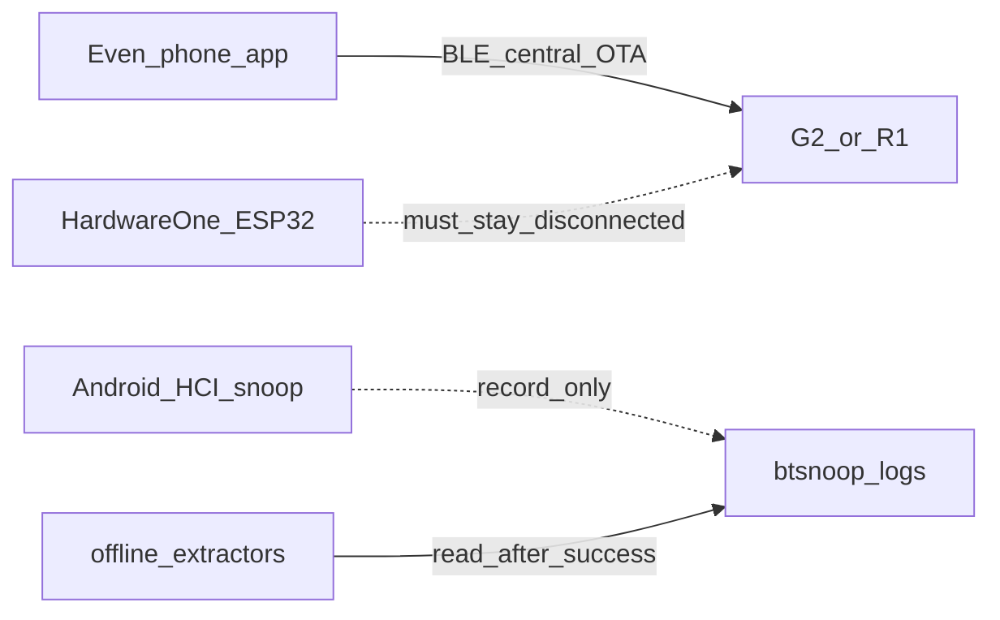

# Passive OTA / firmware capture (G2 glasses & R1 ring)

Goal: learn from shipping firmware updates **without participating in them**.
The Even phone app owns the BLE link and must finish successfully. We only
record HCI on the phone and parse the log offline afterward.

Related: [`OTA_RESEARCH_FINDINGS_2026-07-31.md`](OTA_RESEARCH_FINDINGS_2026-07-31.md),
[`BTSNOOP_SESSION_2026-07-31.md`](BTSNOOP_SESSION_2026-07-31.md),
[`tools/btsnoop/README.md`](../tools/btsnoop/README.md),
[`g2_proto/ota_transmit.proto`](g2_proto/ota_transmit.proto).

---

## Safety contract

| Rule | Why |
|---|---|
| Phone Even app is the only central during OTA | Competing centrals (Hardware One, BLE proxies) can stall ATT and **fail the update** |
| No MitM / GATT proxy | Injecting or delaying ACKs can brick or abort flash |
| No ESP32 “help” | Do not invent a live G2/R1 OTA client for phone-owned updates |
| Tooling is offline + read-only | Extractors never transmit |
| R1 `otaStart` (subCmd `0x09`) is **observe-only** | Enters DFU/bootloader path — brick hazard if sent without a valid signed image |
| Never replay DFU control/packet writes | Same hazard class as `otaStart` |



---

## Preflight checklist

1. **Developer options → Enable Bluetooth HCI snoop log**
2. **Disconnect** Hardware One / ESP32 / any `ble_proxy` from glasses and ring
3. Open Even app; apply **one device at a time** until the app reports **success**
4. Pull the snoop (below), then extract offline

Android rotates **two** files under `/data/misc/bluetooth/logs/` (default
**65535 packets** each): `btsnoop_hci.log` and `btsnoop_hci.log.last`. A full G2
flash often spans both. `pull_hci.sh` copies both and builds
`btsnoop_hci.combined.log` (`.last` then current). Prefer the combined file for
G2 extract.

Expanding `persist.bluetooth.btsnoopsize` is optional and often blocked on
user-keys / GrapheneOS without root — combining the two files is enough.

---

## Tools

| Path | Role |
|---|---|
| [`tools/btsnoop/pull_hci.sh`](../tools/btsnoop/pull_hci.sh) | `adb bugreport` → current + `.last` + **combined** under `.scratch/btsnoop/` |
| [`tools/btsnoop/ota_extract.py`](../tools/btsnoop/ota_extract.py) | G2 OTA/EFS + component rebuild; R1 frame observe |
| [`tools/btsnoop/evenota_split.py`](../tools/btsnoop/evenota_split.py) | Offline split of archived G2 `EVENOTA` bins |
| [`tools/btsnoop/r1_dfu_extract.py`](../tools/btsnoop/r1_dfu_extract.py) | Nordic Secure DFU → init `.dat` + app `.bin` (+ zip) |
| [`tools/btsnoop/r1_fw_analyze.py`](../tools/btsnoop/r1_fw_analyze.py) | Init protobuf decode + image string/BOM mine |

Use **absolute paths** from `~` if relative `tools/...` fails in your shell cwd.

### Pull

```bash
# optional: ADB_SERIAL=...
./tools/btsnoop/pull_hci.sh g2-ota    # or r1-ota
# → .scratch/btsnoop/<label>-<stamp>/
#    btsnoop_hci.log
#    btsnoop_hci.log.last          (if present)
#    btsnoop_hci.combined.log      ← prefer for G2
```

### G2 extract

```bash
python3 tools/btsnoop/ota_extract.py \
  .scratch/btsnoop/g2-ota-<timestamp>/btsnoop_hci.combined.log \
  -o .scratch/btsnoop/g2-ota-<timestamp>/out
```

| Output | Contents |
|---|---|
| `timeline.txt` | G2 OTA/EFS + interesting R1 observe lines |
| `g2_ota_cmds.jsonl` | Per-envelope metadata + `pb_hex` |
| `g2_ota_raw.bin` / `g2_ota_raw_partNN.bin` | Concatenated / split `SID 0xC1` streams |
| `g2_ota_component_NN_*.bin` | Rebuilt from FILE_CHECK + 4 KB blocks |
| `g2_ota_components.json` | Names, sizes, CRC32C |
| `by_handle/` | Per-ATT-handle C0/C1 dumps |
| `gatt_handles.json` | UUID↔handle guesses when discovery is in the log |
| `r1_frames.jsonl` | R1 observe only (`otaStart` flagged — never send) |
| `README_EXTRACT.txt` | Stats |

### Archived EVENOTA (no device)

```bash
python3 tools/btsnoop/evenota_split.py \
  /Users/morgan/g2-firmware-archive/g2-2.2.6.10-e28738432d7b612d625331b00383149b.bin \
  -o .scratch/btsnoop/evenota-2.2.6.10
```

### R1 Secure DFU extract + analyze

```bash
python3 tools/btsnoop/r1_dfu_extract.py \
  .scratch/btsnoop/r1-ota-<timestamp>/btsnoop_hci.log \
  -o .scratch/btsnoop/r1-ota-<timestamp>/dfu_out

python3 tools/btsnoop/r1_fw_analyze.py \
  --bin .scratch/btsnoop/r1-ota-<timestamp>/dfu_out/r1_dfu_application.bin \
  --dat .scratch/btsnoop/r1-ota-<timestamp>/dfu_out/r1_dfu_init.dat \
  -o .scratch/btsnoop/r1-ota-<timestamp>/dfu_out
```

| Output | Contents |
|---|---|
| `r1_dfu_init.dat` / `.json` | Signed Nordic init packet (+ decoded fields) |
| `r1_dfu_application.bin` | Stitched app image |
| `r1_dfu_application.zip` | Minimal DFU zip (`manifest` + dat + bin) |
| `crc_checks.jsonl` | Per-object CRC vs device (`CALC_CRC`) |
| `timeline_dfu.txt` | Control-point session |
| `r1_fw_analysis.txt` | Versions, BOM strings, hash check |

**Integrity checks (HCI-proven):**

- Data-object CRCs: zlib/IEEE, **cumulative** over the whole image so far
- Init `hash`: `SHA256(application.bin)` with digest bytes **reversed** (nrfutil little-endian)

---

## Wire map

### G2 OTA / file SIDs

Envelope:

```
AA | 21=TX / 12=RX | seq | len | totFrags | fragIdx | sid | flag | payload… | CRC16-CCITT-FALSE LE
```

| SID | Role |
|---|---|
| `0xC0` | OTA cmd: `0x00` BEGIN, `0x01` FILE_CHECK (+128 B subheader), `0x02` DATA_MARKER, `0x03` END |
| `0xC1` | 4096-byte firmware blocks (fragmented) |
| `0xC2`/`0xC3` | OTA export |
| `0xC4`–`0xC7` | EFS file service |

GATT (when discovery is visible): DATA write `…e0001`, notify `…e0002`, svc `…e1001`;
CTRL heartbeat on `…e5450` / write `…e5401`. Arms flashed one at a time (second BEGIN).

### R1

Normal frames: `transferType | CRC32 | 12-byte model header | payload`
([`System_R1_Protocol.h`](../components/hardwareone/System_R1_Protocol.h)).

**Update path (HCI-proven, Even app 2.2.7):**

1. `otaStart` (subCmd `0x09`) on normal R1 chars — observe only
2. ACL **disconnect**
3. Reconnect → Nordic **Secure DFU** (control + packet ATT handles; Create / Select /
   Set PRN / Calc CRC / Execute; init object then 4 KB data pages)
4. Reboot; `deviceInfo` shows new version

This is **not** SMP/MCUmgr on the wire in the 2026-07-31 capture (no `8D53…` UUID
traffic). Package format matches stock Nordic DFU zips (archive BL/SD packages use
the same init hashing rules).

---

## What this is not

- Not ESP32 self-OTA ([`OTA_RECOVERY_UPDATER_PLAN.md`](OTA_RECOVERY_UPDATER_PLAN.md))
- Not a live sniffer that injects
- Not permission to probe dangerous R1 system SETs
- Not a substitute for [`DEVICE_SETTINGS_BACKLOG.md`](DEVICE_SETTINGS_BACKLOG.md)

---

## After a successful capture

1. Prefer `btsnoop_hci.combined.log` for G2; confirm BEGIN / FILE_CHECK / END in `timeline.txt`
2. For R1: `r1_dfu_extract` → `crc_ok == crc_checks` and `init_image_hash_match` (LE SHA-256)
3. Keep raw logs under `.scratch/btsnoop/` (gitignored) — do not commit blobs
