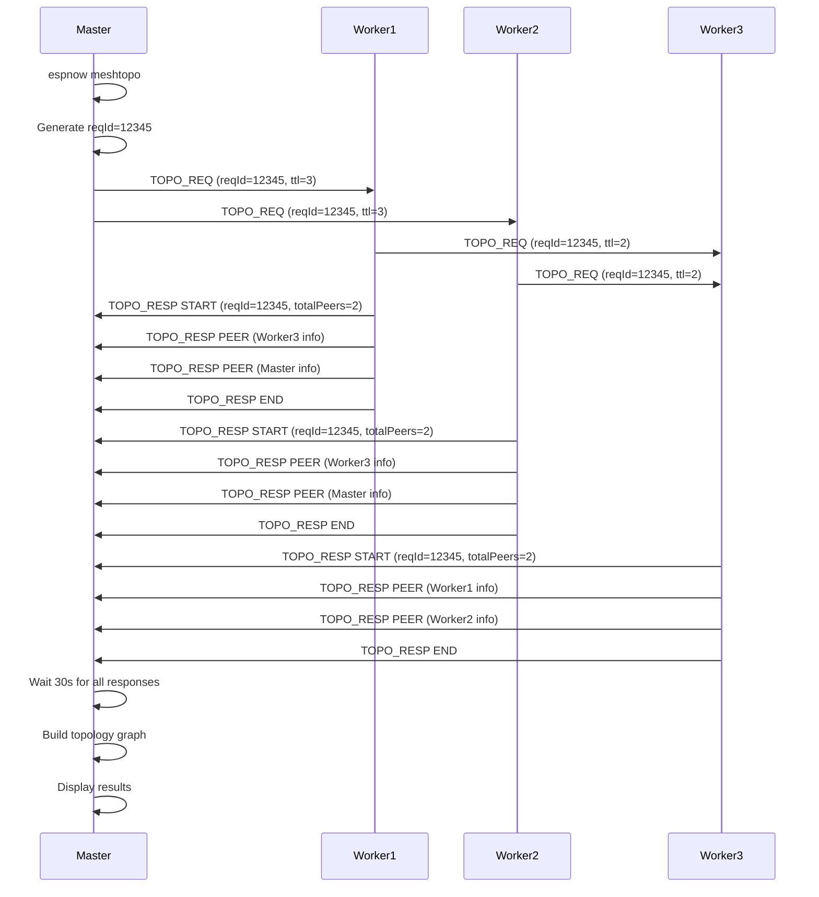

# ESP-NOW System Architecture

## Complete System Overview


## Message Type Flow Details


## Heartbeat State Machine

```mermaid
stateDiagram-v2
    [*] --> Idle
    Idle --> CheckMode: 10s Timer
    
    CheckMode --> PublicMode: meshHeartbeatBroadcast=true
    CheckMode --> PrivateMode: meshHeartbeatBroadcast=false
    
    PublicMode --> BroadcastHB
    BroadcastHB --> Unencrypted
    Unencrypted --> UpdateSelf
    
    PrivateMode --> CheckPeers
    CheckPeers --> SkipHB: 0 Peers
    CheckPeers --> SendToPeers: Has Peers
    SendToPeers --> V2Transport
    V2Transport --> PerPeerEncrypt
    PerPeerEncrypt --> UpdateSelf
    SkipHB --> UpdateSelf
    
    UpdateSelf --> CleanupStale
    CleanupStale --> Idle
    
    note right of BroadcastHB: Send to FF:FF:FF:FF:FF:FF
    note right of Unencrypted: Plain JSON
    note right of CheckPeers: Count Paired Peers
    note right of V2Transport: Use v2 Protocol
    note right of PerPeerEncrypt: Encrypt per Peer
```

## Fragmentation Reassembly


## Device Pairing Flow


## Topology Discovery Flow



## Key Data Structures

### EspNowState (304KB)
- **initialized**: bool
- **channel**: uint8_t (11)
- **mode**: ESPNOW_MODE_DIRECT | ESPNOW_MODE_MESH
- **devices[16]**: Device registry with MAC, name, encrypted flag, key[16]
- **unpairedDevices[16]**: Discovered but not paired
- **chunkBuffers[4]**: Fragment reassembly (max 4 concurrent)
- **retryQueue[8]**: Failed message retry
- **peerMessageHistories[16]**: Per-device message history (30-100 messages each)
- **routerMetrics**: Counters for sent/received/failed/retried
- **derivedKey[16]**: Encryption key from passphrase

### Message Types
- **HB**: Heartbeat (mesh peer discovery)
- **ACK**: Acknowledgment (reliability)
- **FRAG**: Fragment (large message piece)
- **CMD**: Remote command execution
- **TEXT**: Text message
- **RESPONSE**: Command response
- **TOPO_REQ**: Topology discovery request
- **TOPO_RESP**: Topology discovery response
- **MESH_SYS**: Mesh system message

### Transport Modes
- **v2 Small**: < 200 bytes, single packet, optional ACK
- **v2 Fragmented**: >= 200 bytes, multiple fragments, reassembly required

### Encryption
- **Hardware-based**: ESP-NOW uses AES-128 with LMK (Local Master Key)
- **Per-peer**: Each peer has encrypt flag and optional 16-byte key
- **Automatic**: Encryption/decryption handled by ESP-NOW hardware layer
