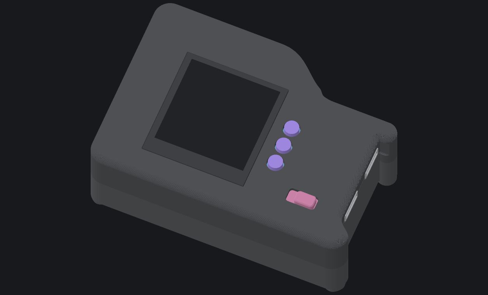
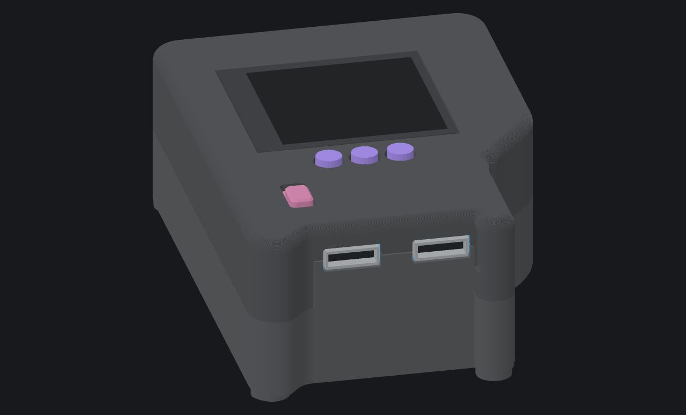
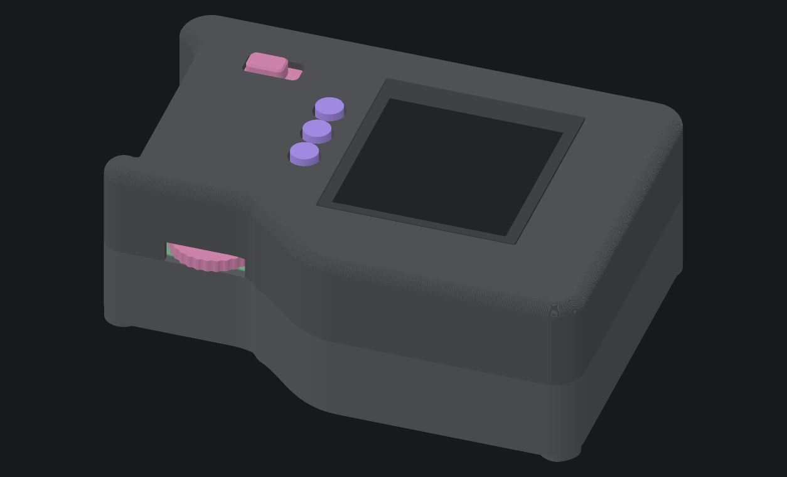
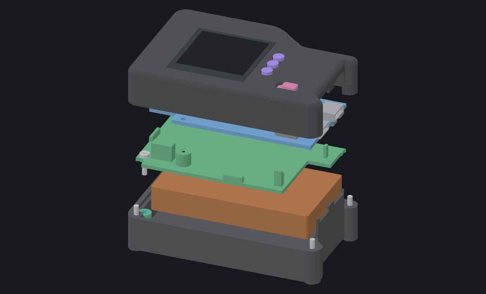
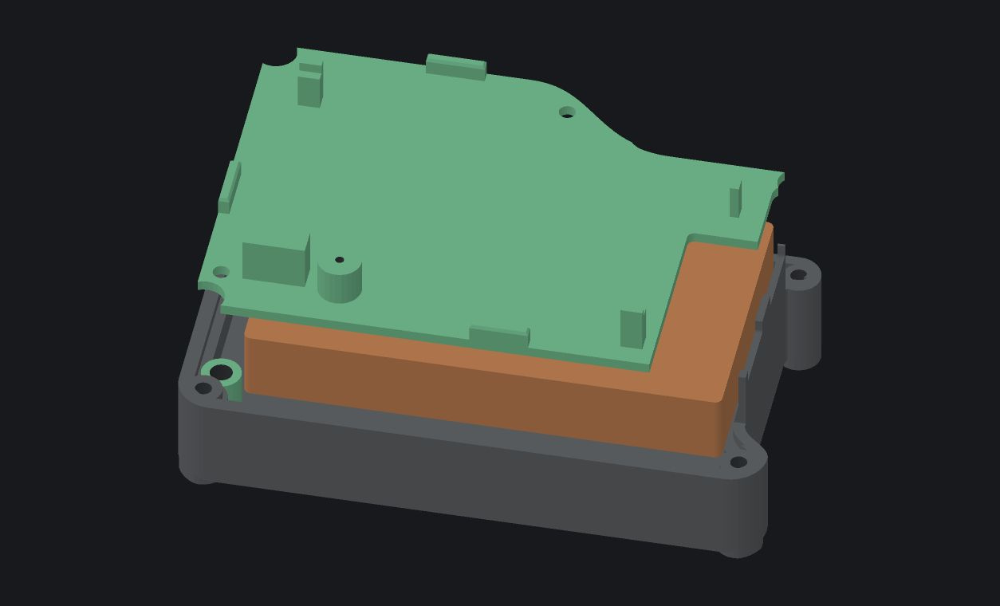
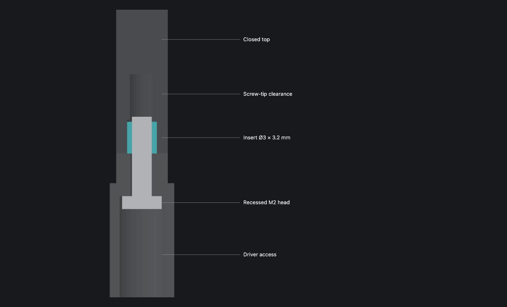

# ESP32-P4X-EYE enclosure — camera omitted

Revision 21 is a compact enclosure for the ESP32-P4X-EYE board with its
detachable camera left off. It carries the board, display, and a
36 × 65 × 10 mm battery in an 80 × 56 × 29 mm body. The screen, three top
buttons, power switch, rotary wheel, microSD slot, and both USB-C ports remain
usable.

The colours in these renders distinguish the printed parts, PCB, display, and
battery. They are not the intended finish; the enclosure is intended for clear
resin. The physical fit of this R21 design has been verified by the builder.

## Finished enclosure

The display sits in a recessed lid seat, close to flush with the top surface.
The three printed buttons extend about 1 mm above the lid so they are easy to
find and provide a little screen protection when the device is face-down. The
small pink cap is the printed power-slider extension.

## Ports and controls

Both USB-C ports meet the enclosure edge through close-fitting openings. The
right-hand side has a local scallop so a 10.25 × 6 mm cable housing has room
beside the corner fastener.

The wheel-side wall follows the original controller more closely than a simple
rectangular cutout. That exposes the rotary wheel for fingertip use while
keeping the rest of the corner closed and rounded. The same edge keeps the
microSD area accessible.

## Inside the case

The enclosure is arranged as a lid and display, the EYE board, a midframe, the
battery, and the base. The printed button strip, keeper, and power slider
complete the lid controls.

The midframe follows the irregular board outline, locates the board through
its mounting tab, and sits flat over the battery. Its open bay gives the
battery lead a clear route to the board connector without trapping the cable.

## How it closes

The base, midframe, and lid use locating keys as well as screws. Four M2 case
screws enter from the underside into blind lid insert pockets, so no case-screw
heads appear on the top face. Two more M2 screws secure the midframe to the
base. The board uses its own small mounting point in the midframe.

## Model files

The printable set has six pieces: base, lid, midframe, button strip, button
keeper, and power slider. The editable source is
[enclosure.scad](enclosure.scad); the matching printable files are in
[stl/](stl/), and supplier drawings are in [drawings/](drawings/).

Use the R21 files as a matched set. The lid, button strip, keeper, and power
slider are designed to work together.
